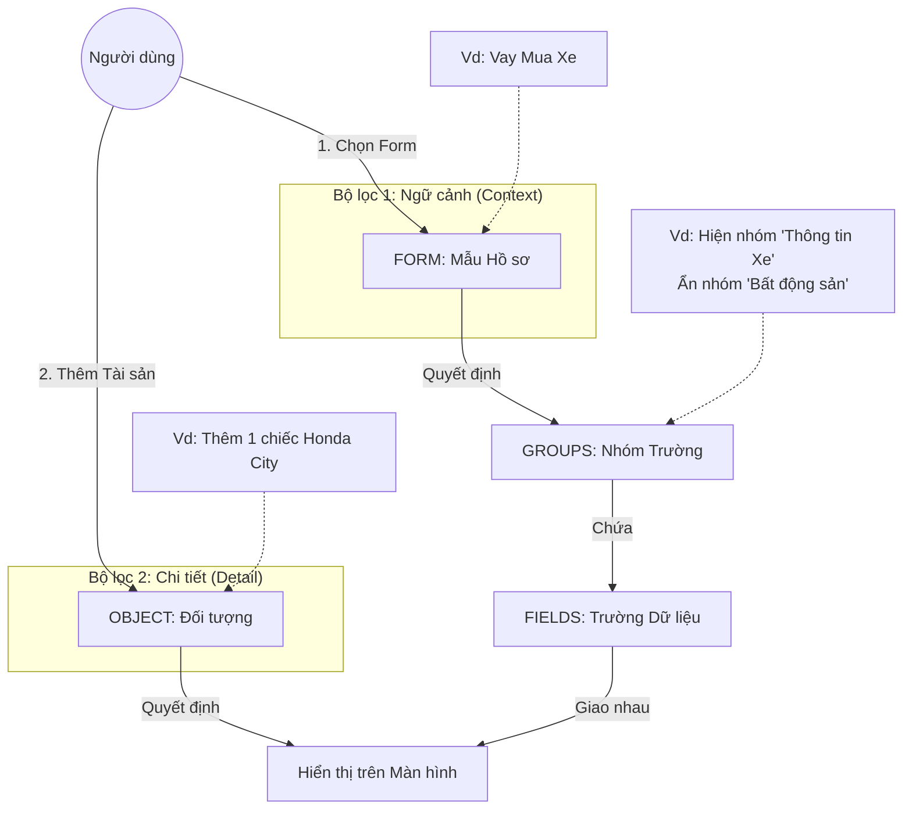

# Hướng dẫn Cấu trúc Hệ thống: Forms, Groups, Objects, và Fields

Hệ thống hoạt động như một **Bộ lọc kép (Dual-Filter System)** để đảm bảo người dùng chỉ nhìn thấy thông tin cần thiết.

### 1. Sơ đồ Mối quan hệ (Mental Model)

### 2. Định nghĩa & Vai trò

| Thành phần | Câu hỏi định nghĩa | Vai trò & Cách sử dụng đúng |
| :--- | :--- | :--- |
| **FORM** (Mẫu hồ sơ) | *"Chúng ta đang làm việc gì?"* (Vd: Vay mua xe, Vay mua nhà) | **Bộ lọc cấp cao nhất (Theo Quy trình).** Dùng để quyết định xem trong loại hồ sơ này, những **Nhóm thông tin (Group)** nào *được phép* xuất hiện. -> *Ví dụ: Form "Vay tín chấp" thì đừng hiện nhóm "Tài sản đảm bảo".* |
| **GROUP** (Nhóm trường) | *"Thông tin này thuộc chủ đề gì?"* (Vd: Thông tin pháp lý, Đặc điểm kỹ thuật) | **Đơn vị bố cục giao diện.** Dùng để gom các trường liên quan lại với nhau và định vị chúng (Cột Trái/Phải). -> *Ví dụ: Tạo nhóm "Đặc điểm xe" để chứa: Biển số, Màu, Số khung...* |
| **OBJECT** (Loại đối tượng) | *"Cái này là cái gì?"* (Vd: Ô tô, Nhà đất, Sổ tiết kiệm) | **Bộ lọc chi tiết (Theo Thực thể).** Dùng để quyết định trong một nhóm, những **Trường (Field)** nào liên quan đến vật thể này. -> *Ví dụ: Khi nhập một "Ô tô", chỉ hiện trường "Biển số", ẩn "Số tờ/thửa".* |
| **FIELD** (Trường dữ liệu)| *"Dữ liệu cụ thể là gì?"* (Vd: Biển kiểm soát, Tổng diện tích) | **Hạt nhân dữ liệu.** Là nơi lưu trữ giá trị thực tế. Một Field phải thuộc về 1 Group. |

---

### 3. Ví dụ Thực tế: Logic hoạt động

Hãy xét trường hợp bạn cấu hình cho **Vay Mua Xe**.

#### Bước 1: Cấu hình (Người quản trị làm)
1.  **Forms**: Tạo Form "Vay Mua Xe".
2.  **Groups**:
    *   Tạo nhóm "Thông tin chung" -> Gán vào Form "Vay Mua Xe".
    *   Tạo nhóm "Đặc điểm tài sản" -> Gán vào Form "Vay Mua Xe".
    *   Tạo nhóm "Thông tin đất ở" -> **KHÔNG** gán vào Form này (Vì mua xe không cần khai đất).
3.  **Objects**: Định nghĩa loại "Ô tô" và "Bất động sản".
4.  **Fields**:
    *   Trường "Biển số xe": Thuộc nhóm "Đặc điểm tài sản", gán loại Object "Ô tô".
    *   Trường "Diện tích": Thuộc nhóm "Đặc điểm tài sản", gán loại Object "Bất động sản".

#### Bước 2: Sử dụng (Người dùng thao tác)
1.  Người dùng chọn tạo hồ sơ **"Vay Mua Xe"**.
    *   *Hệ thống:* Hiển thị nhóm "Thông tin chung" và "Đặc điểm tài sản". Nhóm "Thông tin đất ở" bị ẩn ngay lập tức.
2.  Người dùng bấm nút **"Thêm Tài sản"** và chọn loại **"Ô tô"**.
    *   *Hệ thống:* Trong nhóm "Đặc điểm tài sản", nó lọc ra các trường có loại là "Ô tô".
    *   -> **Kết quả:** Người dùng chỉ thấy ô nhập "Biển số xe". Ô "Diện tích" bị ẩn đi (dù nó cũng nằm trong nhóm này, nhưng nó thuộc loại BĐS).

### 4. Cách sử dụng đúng (Best Practices)

1.  **Đừng tạo quá nhiều Group nhỏ:** Hãy cố gắng dùng **Object Type** để lọc chi tiết. Ví dụ thay vì tạo Group "Đặc điểm Xe" và Group "Đặc điểm Nhà" riêng biệt, bạn có thể tạo một Group chung là "Đặc điểm Tài sản" và dùng Object Type để lọc các trường bên trong. Điều này giúp giao diện gọn gàng hơn.
2.  **Sử dụng Form để định hướng:** Nếu một quy trình không bao giờ dùng đến Tài sản (như Vay thấu chi lương), hãy dùng Form để tắt hẳn Group Tài sản đi. Đừng bắt người dùng phải nhìn thấy một bảng trống.
3.  **Tận dụng "Layout Position":** Dùng Cột Trái cho các thông tin quan trọng/nhập liệu chính (Pháp lý, Con người). Dùng Cột Phải cho các thông tin bổ trợ hoặc danh sách dài (Tài sản).
