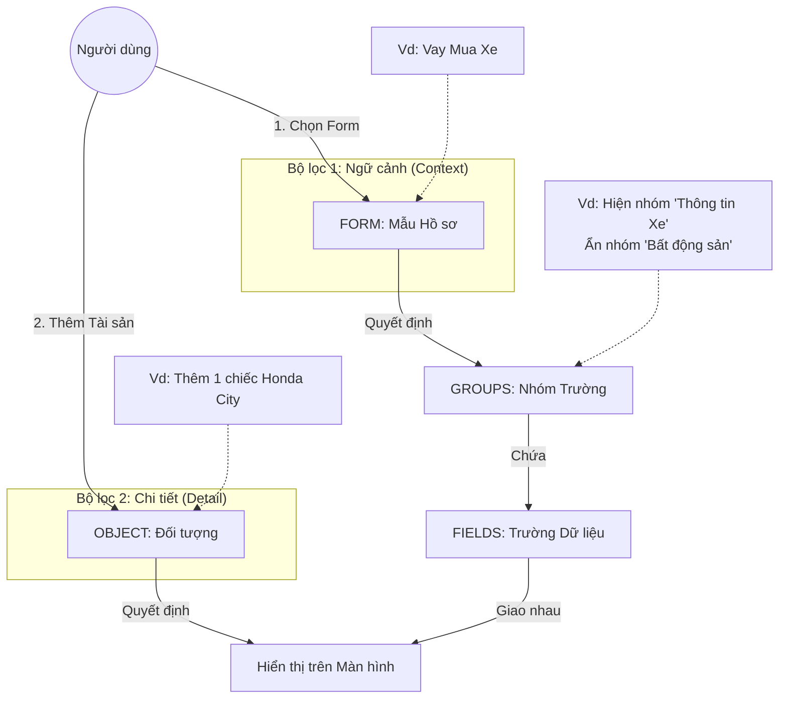

# Hướng dẫn Cấu trúc Hệ thống: Forms, Groups, Objects, và Fields

## Tổng quan

Hệ thống Vietbank Contract App sử dụng kiến trúc **Bộ lọc kép (Dual-Filter System)** để đảm bảo người dùng chỉ nhìn thấy thông tin cần thiết cho từng loại hồ sơ. Tài liệu này hướng dẫn **Quản trị viên** cách cấu hình các thành phần trong ứng dụng một cách tường minh, đúng logic và vai trò của từng thành phần.

> **Đối tượng**: Quản trị viên hệ thống, người có quyền cấu hình Forms, Groups, Objects và Fields trong Admin Panel.

---

## 1. Sơ đồ Mối quan hệ (Mental Model)

### Giải thích Luồng hoạt động

1. **Người dùng chọn Form** (ví dụ: "Vay Mua Xe")
   - Hệ thống lọc và chỉ hiển thị các **Groups** được gán cho Form này
   
2. **Người dùng thêm Object** (ví dụ: "Ô tô")
   - Hệ thống lọc tiếp và chỉ hiển thị các **Fields** thuộc Object này trong các Groups đã được hiển thị

3. **Kết quả**: Người dùng chỉ thấy đúng những trường cần thiết, giao diện gọn gàng và tập trung

---

## 2. Định nghĩa & Vai trò

| Thành phần | Câu hỏi định nghĩa | Vai trò & Cách sử dụng đúng |
| :--- | :--- | :--- |
| **FORM** (Mẫu hồ sơ) | *"Chúng ta đang làm việc gì?"* (Vd: Vay mua xe, Vay mua nhà) | **Bộ lọc cấp cao nhất (Theo Quy trình).** Dùng để quyết định xem trong loại hồ sơ này, những **Nhóm thông tin (Group)** nào *được phép* xuất hiện. → *Ví dụ: Form "Vay tín chấp" thì đừng hiện nhóm "Tài sản đảm bảo".* |
| **GROUP** (Nhóm trường) | *"Thông tin này thuộc chủ đề gì?"* (Vd: Thông tin pháp lý, Đặc điểm kỹ thuật) | **Đơn vị bố cục giao diện.** Dùng để gom các trường liên quan lại với nhau và định vị chúng (Cột Trái/Phải). → *Ví dụ: Tạo nhóm "Đặc điểm xe" để chứa: Biển số, Màu, Số khung...* |
| **OBJECT** (Loại đối tượng) | *"Cái này là cái gì?"* (Vd: Ô tô, Nhà đất, Sổ tiết kiệm) | **Bộ lọc chi tiết (Theo Thực thể).** Dùng để quyết định trong một nhóm, những **Trường (Field)** nào liên quan đến vật thể này. → *Ví dụ: Khi nhập một "Ô tô", chỉ hiện trường "Biển số", ẩn "Số tờ/thửa".* |
| **FIELD** (Trường dữ liệu)| *"Dữ liệu cụ thể là gì?"* (Vd: Biển kiểm soát, Tổng diện tích) | **Hạt nhân dữ liệu.** Là nơi lưu trữ giá trị thực tế. Một Field phải thuộc về 1 Group và có thể gắn với 1 hoặc nhiều Object Types. |

---

## 3. Ví dụ Thực tế: Cấu hình "Vay Mua Xe"

### Bước 1: Cấu hình (Quản trị viên thực hiện)

#### 3.1. Tạo Form
1. Truy cập **Admin Panel** → **Khung nhập liệu (Forms)**
2. Nhấp **"Thêm mới"**
3. Điền thông tin:
   - **Tên Form**: "Vay Mua Xe"
   - **Mã (Slug)**: "vay-mua-xe"
   - **Mô tả**: "Form dành cho hồ sơ vay mua ô tô"
4. Lưu Form

#### 3.2. Tạo Groups
1. Truy cập **Admin Panel** → **Nhóm Thông tin (Groups)**
2. Tạo các nhóm sau:

| Tên nhóm | Vị trí | Gán vào Form "Vay Mua Xe" |
|----------|--------|---------------------------|
| "Thông tin chung" | Cột Trái | ✅ Có |
| "Thông tin khoản vay" | Cột Trái | ✅ Có |
| "Đặc điểm tài sản" | Cột Phải | ✅ Có |
| "Thông tin đất ở" | Cột Phải | ❌ **Không** (vì mua xe không cần) |

> **Quan trọng**: Chỉ gán những nhóm thực sự cần thiết vào Form. Nhóm không được gán sẽ **không hiển thị** khi người dùng chọn Form này.

#### 3.3. Định nghĩa Objects
1. Truy cập **Admin Panel** → **Vai trò (Objects/Roles)**
2. Tạo các loại đối tượng:
   - **"Ô tô"** (slug: `o-to`)
   - **"Bất động sản"** (slug: `bat-dong-san`)

#### 3.4. Tạo Fields
1. Truy cập **Admin Panel** → **Trường Thông tin (Fields)**
2. Tạo các trường sau:

| Nhãn | Key | Nhóm | Object Type | Loại dữ liệu |
|------|-----|------|-------------|--------------|
| "Biển số xe" | `bien_so_xe` | Đặc điểm tài sản | Ô tô | Văn bản |
| "Số khung" | `so_khung` | Đặc điểm tài sản | Ô tô | Văn bản |
| "Màu xe" | `mau_xe` | Đặc điểm tài sản | Ô tô | Văn bản |
| "Diện tích" | `dien_tich` | Đặc điểm tài sản | Bất động sản | Số |
| "Số tờ/thửa" | `so_to_thua` | Đặc điểm tài sản | Bất động sản | Văn bản |

> **Lưu ý**: Các trường "Biển số xe", "Số khung", "Màu xe" chỉ hiển thị khi người dùng thêm đối tượng loại "Ô tô". Tương tự, "Diện tích" và "Số tờ/thửa" chỉ hiển thị với "Bất động sản".

---

### Bước 2: Sử dụng (Người dùng cuối thao tác)

#### Kịch bản 1: Tạo hồ sơ Vay Mua Xe
1. Người dùng chọn **"Vay Mua Xe"** từ dropdown
   - **Hệ thống tự động**:
     - ✅ Hiển thị nhóm "Thông tin chung"
     - ✅ Hiển thị nhóm "Thông tin khoản vay"
     - ✅ Hiển thị nhóm "Đặc điểm tài sản"
     - ❌ Ẩn nhóm "Thông tin đất ở" (vì không được gán vào Form)

2. Người dùng nhấp **"Thêm Tài sản"** → Chọn loại **"Ô tô"**
   - **Hệ thống tự động**:
     - Trong nhóm "Đặc điểm tài sản", chỉ hiển thị:
       - ✅ Biển số xe
       - ✅ Số khung
       - ✅ Màu xe
     - Ẩn các trường:
       - ❌ Diện tích (thuộc Bất động sản)
       - ❌ Số tờ/thửa (thuộc Bất động sản)

#### Kịch bản 2: Nếu người dùng chọn "Bất động sản"
- Hệ thống sẽ hiển thị:
  - ✅ Diện tích
  - ✅ Số tờ/thửa
- Và ẩn:
  - ❌ Biển số xe
  - ❌ Số khung
  - ❌ Màu xe

---

## 4. Cách sử dụng đúng (Best Practices)

### 4.1. Đừng tạo quá nhiều Group nhỏ
❌ **Không nên**:
- Group "Đặc điểm Xe"
- Group "Đặc điểm Nhà"
- Group "Đặc điểm Sổ tiết kiệm"

✅ **Nên**:
- Group "Đặc điểm Tài sản" (chung)
- Dùng **Object Type** để lọc các trường bên trong

**Lý do**: Giảm số lượng nhóm giúp giao diện gọn gàng hơn. Người dùng không phải cuộn qua nhiều nhóm trống.

### 4.2. Sử dụng Form để định hướng
❌ **Không nên**:
- Gán tất cả Groups vào tất cả Forms
- Để người dùng nhìn thấy nhóm "Tài sản đảm bảo" trong Form "Vay thấu chi lương"

✅ **Nên**:
- Chỉ gán những Groups thực sự cần thiết cho từng Form
- Nếu một quy trình không bao giờ dùng đến Tài sản, đừng gán Group Tài sản vào Form đó

**Lý do**: Tránh làm người dùng bối rối với các trường không liên quan.

### 4.3. Tận dụng "Layout Position" (Vị trí Cột)
✅ **Cột Trái** (Left Column):
- Thông tin quan trọng
- Thông tin nhập liệu chính
- Thông tin pháp lý
- Thông tin con người (Bên vay, Bên thế chấp)

✅ **Cột Phải** (Right Column):
- Thông tin bổ trợ
- Danh sách dài (Tài sản, Người liên quan)
- Thông tin chi tiết kỹ thuật

**Lý do**: Người dùng thường đọc từ trái sang phải, ưu tiên thông tin quan trọng ở bên trái.

### 4.4. Đặt tên rõ ràng và nhất quán
✅ **Tốt**:
- "Thông tin khoản vay"
- "Đặc điểm tài sản"
- "Thông tin pháp lý"

❌ **Không tốt**:
- "Nhóm 1"
- "Thông tin khác"
- "Misc"

**Lý do**: Tên rõ ràng giúp người dùng dễ tìm kiếm và quản trị viên dễ bảo trì.

### 4.5. Sử dụng Object Type một cách thông minh
✅ **Nên**:
- Tạo Object Type cho các loại tài sản khác biệt rõ ràng:
  - "Ô tô"
  - "Bất động sản"
  - "Sổ tiết kiệm"
  - "Cổ phiếu"

❌ **Không nên**:
- Tạo quá chi tiết:
  - "Ô tô sedan"
  - "Ô tô SUV"
  - "Ô tô bán tải"

**Lý do**: Object Type quá chi tiết sẽ làm phức tạp hóa việc cấu hình. Nếu cần phân biệt, hãy dùng Field "Loại xe" bên trong.

---

## 5. Quy trình Cấu hình Khuyến nghị

### Bước 1: Phân tích Quy trình Nghiệp vụ
- Xác định các loại hồ sơ (Forms) cần hỗ trợ
- Liệt kê các thông tin cần thu thập cho từng loại

### Bước 2: Thiết kế Groups
- Nhóm các thông tin liên quan lại với nhau
- Quyết định vị trí cột (Trái/Phải)
- Gán Groups vào các Forms phù hợp

### Bước 3: Định nghĩa Objects
- Xác định các loại đối tượng (tài sản, người) trong hệ thống
- Tạo Object Types với tên rõ ràng

### Bước 4: Tạo Fields
- Tạo các trường dữ liệu cụ thể
- Gán vào Groups phù hợp
- Gắn với Object Types nếu cần lọc

### Bước 5: Kiểm tra
- Tạo hồ sơ thử nghiệm
- Kiểm tra xem các trường có hiển thị đúng không
- Điều chỉnh nếu cần

---

## 6. Câu hỏi Thường gặp (FAQ)

### Q: Tôi có thể gán một Field vào nhiều Groups không?
**A**: Không. Mỗi Field chỉ thuộc về một Group duy nhất. Nếu cần hiển thị cùng một thông tin ở nhiều nơi, hãy tạo Field mới hoặc xem xét lại cấu trúc Groups.

### Q: Tôi có thể gán một Field vào nhiều Object Types không?
**A**: Có. Một Field có thể thuộc về nhiều Object Types. Ví dụ: Trường "Giá trị" có thể áp dụng cho cả "Ô tô" và "Bất động sản".

### Q: Làm sao để một Field luôn hiển thị bất kể Object Type nào?
**A**: Không gán Object Type cho Field đó. Field không có Object Type sẽ luôn hiển thị trong Group của nó.

### Q: Tôi có thể thay đổi vị trí cột của Group sau khi đã tạo không?
**A**: Có. Bạn có thể chỉnh sửa Group bất kỳ lúc nào trong Admin Panel.

### Q: Nếu tôi xóa một Group, dữ liệu trong các Fields có bị mất không?
**A**: Dữ liệu không bị mất, nhưng các Fields sẽ không hiển thị trên giao diện. Hãy gán lại Fields vào Group khác trước khi xóa.

---

## 7. Tài nguyên Liên quan

- **[Hướng dẫn Admin Panel](./admin-panel-guide.md)**: Hướng dẫn chi tiết cách sử dụng Admin Panel
- **[Cấu trúc Dữ liệu Template](../context_data.md)**: Hướng dẫn sử dụng các biến trong template Word

---

**Phiên bản tài liệu**: 1.0  
**Cập nhật lần cuối**: 19/01/2026  
**Người bảo trì**: Vietbank Development Team
